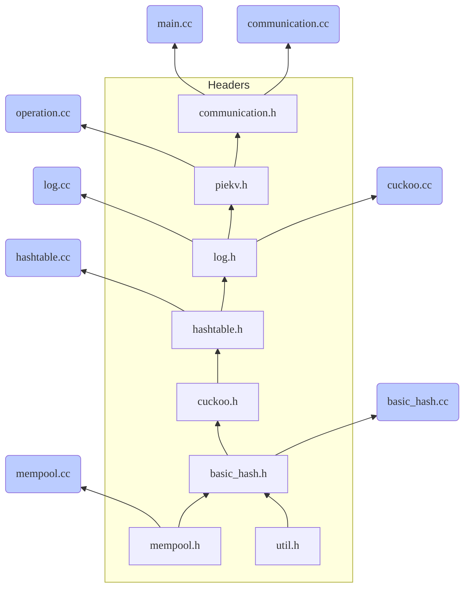

*<u>Updated on Nov 29,2022</u>*


## The Dependencies of Headers & Source files



## 10.176.64.41 Server

### 编译方式

ACEKV&MICA/build 路径下运行

```shell
make -j
```

若当前路径下无Makefile，先运行

```shell
cmake ..
```

memc3在Memc3/build 路径下同理

### 源文件宏定义

> ACEKV&MICA/src/basic_hash.cc

- ```
  #define RUN_MICA
  ```
  该宏定义生效则运行MICA-t，注释掉则运行ACEKV

- ```
  #define MEMC3_EVICT
  ```
  该宏定义生效则按照memc3的方式进行evict，默认关

- ```
  #define USE_COUNTER
  ```
  该宏定义生效则使用counter，默认开
  
- ```
  #define CLEANUP
  ```
  该宏定义生效则mica进行cleanup，默认开
  
- ```
  #define RELOAD
  ```
  该宏定义生效则在get miss后进行reload，默认开

- ```
  #define RELOAD_RECORD
  ```
  该宏定义生效则将reload按set统计，默认关，测cuckoopath时打开
  
- ```
  #define LATENCY
  ```
  该宏定义用于测试latency，默认关
  
- ```
  #define size8
  // #define size64
  // #define size256
  // #define size512
  ```
  在测试不同kvsize时切换使用

### 运行选项

> ACEKV&MICA/build/main

| **-a** | **设定自适应阈值（如-a 50）**                     |
| :----: | ------------------------------------------------- |
| **-f** | **参数为2时监控并显示系统运行状态（一般都要设）** |
| **-l** | **设定每个线程log大小（30为1GB）**                |
| **-t** | **设定hash table总大小（30为1GB）**               |

执行./go脚本将直接在控制台运行

执行./explog脚本将在运行的同时把输出结果写入log文件

### 数据及图片路径

> ACEKV&MICA/data/cuckoo_path

cuckoo path相关图片及数据，最终图片在kick_num文件夹内

> ACEKV&MICA/data/hitrate

hitrate相关图片及数据，最终图片在worktable_enough前缀文件夹内，最终数据在lllatest前缀文件夹内

> ACEKV&MICA/data/latency_cdf

latency相关图片及数据，最终图片output文件夹内

> ACEKV&MICA/data/loadfactor

load factor相关图片及数据，最终图片在ttl后缀文件夹内

> ACEKV&MICA/data/mica_weakness/mica_evict

mica evict相关图片及数据，展示mica本身的劣势，最终图片valid_evict_new文件夹内

> ACEKV&MICA/data/threshold_table

threshold相关数据，用mean.sh脚本加上对应文件夹可计算对应平均值

> ACEKV&MICA/data/throughput

throughput相关图片及数据，最终图片和数据在latest后缀文件夹内

上述大部分图片都使用最近的drawplus.sh生成

> Memc3/data/……

memc3相关数据在上述路径

## 10.176.64.35 Client

### 编译方式

Client文件夹下运行

```shell
make clean && make -j
```

### 源文件宏定义

> Client/client.cpp

- ```
  #define ratiomemc3
  ```

  该宏定义生效则按照memc3的数据量运行

- ```
  ##define ratioacekv
  ```

  该宏定义生效则按照acekv和mica的数据量运行

- ```
  #define GHR
  ```

  该宏定义用于测试hitrate，注释则用于测试tput

**其他宏定义无需关心**

### 运行选项

> Client/build/app/client

|  **-n**  | **设定发送总数（参考go.sh中设置即可，一般设置偏大）**   |
| :------: | ------------------------------------------------------- |
|  **r**   | **设定读取操作的占比（读写均衡即为0.5）**               |
|  **-t**  | **选择发送系统类型，16为mica，8为acekv/memc3**          |
| **-u/z** | **设定数据类型，-u即uniform，-z即skewed，默认后者**     |
|  **-l**  | **设定发送kvsize**                                      |
|  **-w**  | **按照hash table大小设置数据发送比例，默认100，即100%** |

建议使用./go.sh + pu/pz/mu/mz 便捷发送

p用于acekv/memc3，m用于mica