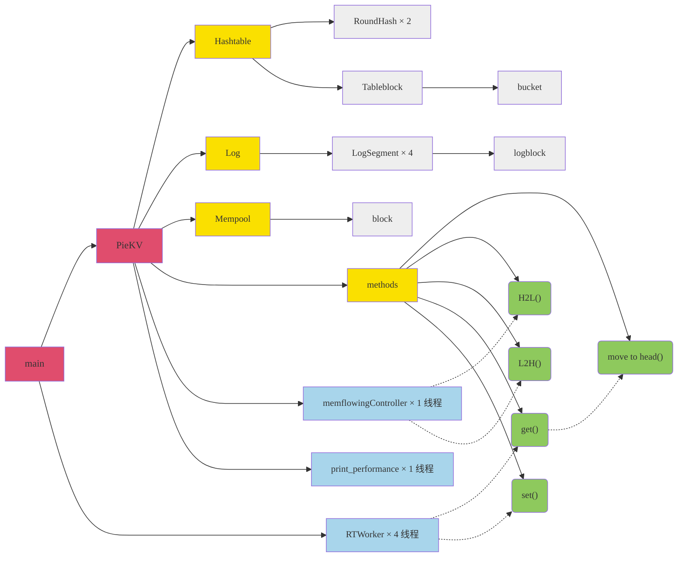
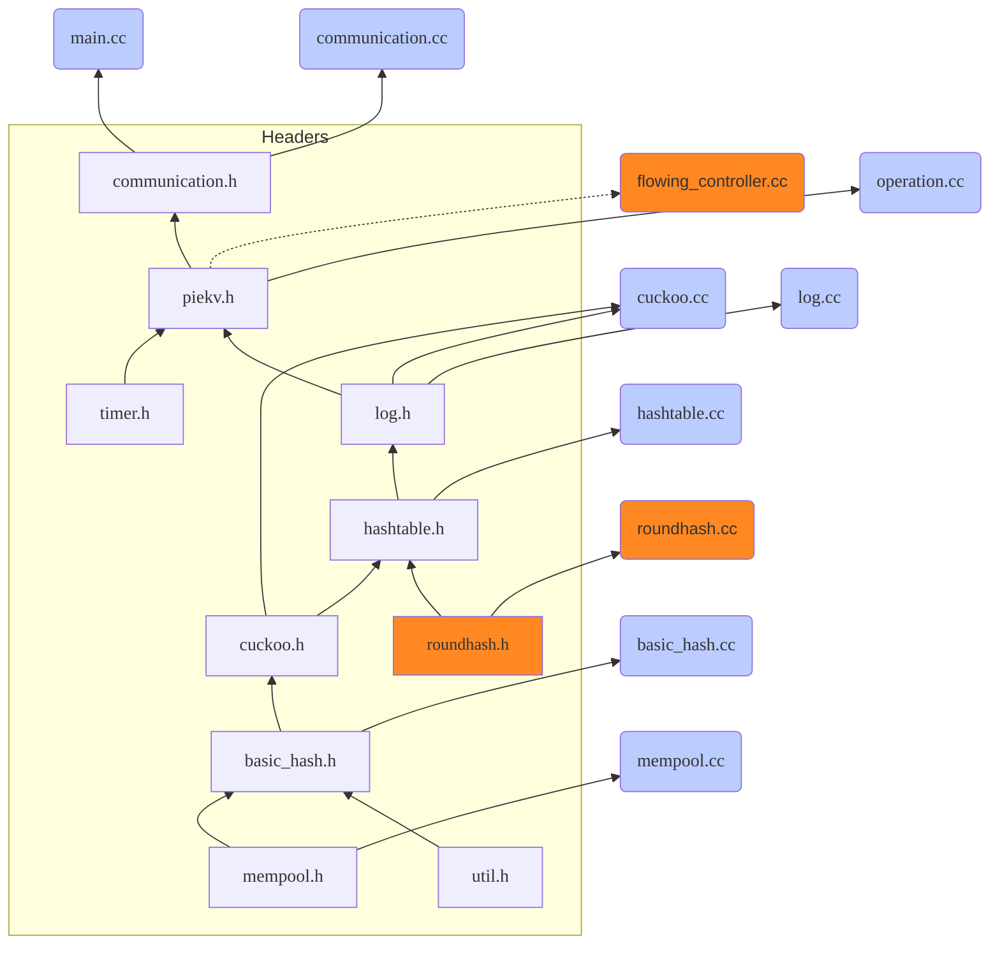

*<u>Updated on Nov 29,2022</u>*

## Class Structure

```mermaid
%%{ init: { 'flowchart': { 'curve': 'basis' } } }%%
flowchart LR
	

	main -->PK
	PK --> Hashtable	
	PK --> Log
	PK --> Mempool
	PK ---> methods
	PK --> mfc
	PK ---> pt

	methods --> mth
	methods --> H2L
	methods --> L2H
	methods --> get
	methods --> set

	get -.->mth
	Hashtable --> RoundHash
	Hashtable --> tb
	tb --> bucket
	Log -->ls
	ls --> logblock

	Mempool --> block

	mfc -.-> H2L
	mfc -.-> L2H

	main ----> rtw
	rtw -.-> get
	rtw -.-> set

	

	classDef header fill:#a8d5eb,font-family:arias,font-size:14px,font-weight:300;
	classDef func fill:#8ec95d,font-family:arias,font-size:14px;
	classDef subclass fill:#fae000,font-family:arias,font-size:14px,font-weight:300;
	classDef common fill:#eeeeee,font-family:arias,font-size:14px,font-weight:300;
	classDef main fill:#e04d6d,font-family:arias,font-size:15px;
		main:::main
		methods:::subclass
		get("get()"):::func
		set("set()"):::func
		H2L("H2L()"):::func
		L2H("L2H()"):::func
		mth("move to head()"):::func
		PK[PieKV]:::main
		RoundHash["RoundHash × 2"]:::common
		logblock:::common
		tb[Tableblock]:::common
		bucket:::common
		block:::common
		Log:::subclass
		Mempool:::subclass
		Hashtable:::subclass
		mfc["memflowingController × 1 线程"]:::header
		pt["print_performance × 1 线程"]:::header
		rtw["RTWorker × 4 线程"]:::header
		ls["LogSegment × 4"]:::common


	

```

## headers‘ dependencies

```mermaid
%%{ init: { 'flowchart': { 'curve': 'basis' } } }%%
flowchart BT
roundhash.h:::header --> rp(roundhash.cc):::diff
piekv.h -.-> fp(flowing_controller.cc):::diff
subgraph Headers
basic_hash.h:::header --> cuckoo.h
cuckoo.h:::header --> hashtable.h
hashtable.h:::header --> log.h
timer.h:::header --> piekv.h
log.h:::header --> piekv.h
mempool.h --> basic_hash.h
piekv.h:::header --> communication.h
roundhash.h:::diff --> hashtable.h

util.h:::header --> basic_hash.h
end
basic_hash.h --> bp(basic_hash.cc):::source


communication.h --> main(main.cc):::source
communication.h:::header --> cp(communication.cc):::source

cuckoo.h --> cc(cuckoo.cc):::source

hashtable.h --> ht(hashtable.cc):::source

log.h --> lg(log.cc):::source
log.h --> cc(cuckoo.cc):::source

mempool.h:::header --> mp(mempool.cc):::source

piekv.h --> op(operation.cc):::source

%%util.h --> zipf.h

%%zipf.h --> NO_INCLUDE
classDef header fill:#eef,font-family:arias,font-size:16px,font-weight:300;
classDef source fill:#bcf,font-family:arias,font-size:16px;
classDef diff fill:#f82,font-size:15px;

```
