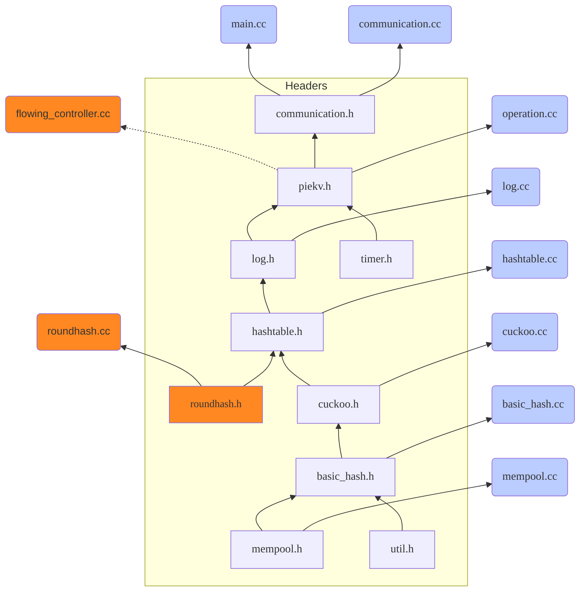

*<u>Updated on Nov 29,2022</u>*

## Class Structure

## headers‘ dependencies

### 程序改造

- flowing_controller.cc全注释，无问题
- roundhash.cc及roundhash.h全注释，无问题
- round_hash_主要提供了一个HashtoBucket()的作用，这部分如何替代？
  - 暂时将round_hash相关全部注释掉，HashtoBucket()用取余代替
    - 如何进一步设计改进？:star:
  - 如果不替代round_hash，现有系统如何实现MICA式的old evict？(暂不考虑)
- 新hash实际上也应当是一个循环hash空间？（如何与cuckoo兼容？）:star:
  - 原有PieKV的主要特点是碎片化，以block和bucket为主要处理单元
  - 而MICA的hash空间的特点类似于循环log
  - MICA的实现建立在hash与log的相对平行关系上（mica不用cuckoo）
  - 不能强行参考MICA而不放弃cuckoo，cuckoo是本:star:
- 多线程如何分配？
- 引入YCSB统一进行实验对比？
